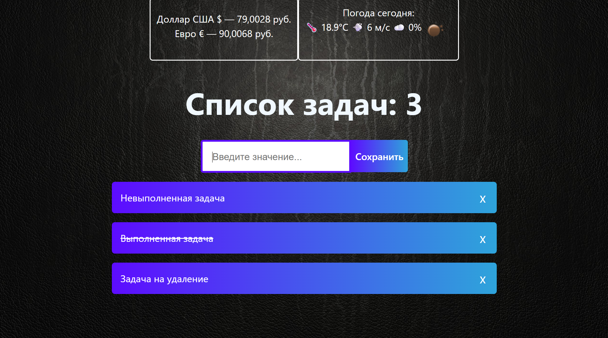

# Простой TODO список сделанный с помощью React и Vite.

# Запуск

Либо через compose.yml
```bash
cd todolist
docker compose up
```

Либо через npm:

```bash
npm ci
npm run dev
```

# Внешний вид



## Виджеты
1) Погода сегодня на основе вашего местоположения
    * Если не дали разрешение на определение местоположения, то будет показан город по умолчанию (Краснодар).
2) Курс доллара и евро на основе API.

## Список задач
1) Задачи можно добавлять по кнопке "Сохранить" или по нажатию Enter.
2) Задачи можно помечать как выполненные, для этого нужно нажать на текст задачи.
3) Задачи можно удалять по крестику около задачи.

# Дополнительно 
Верстка - адаптивная 


